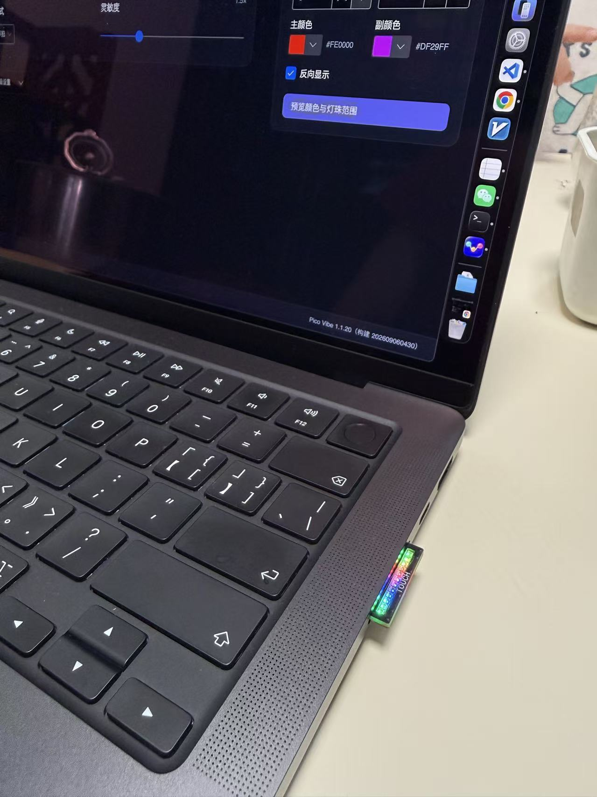
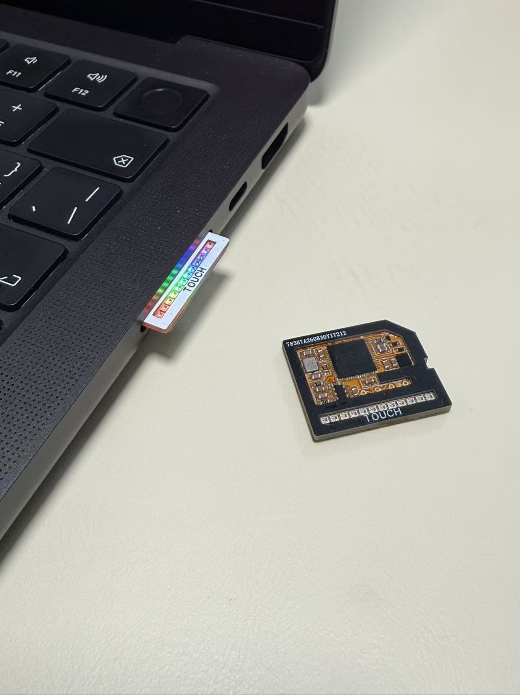
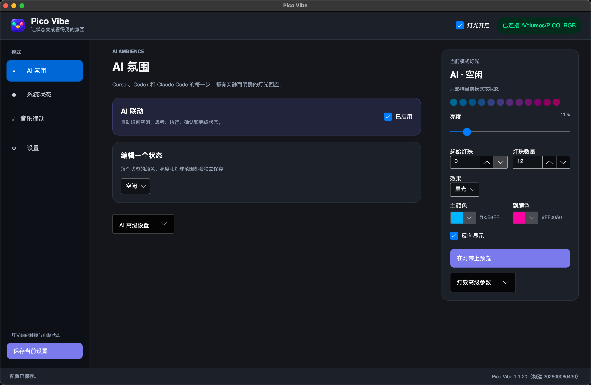
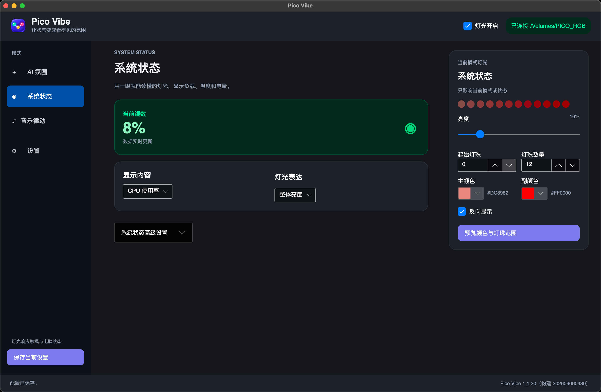
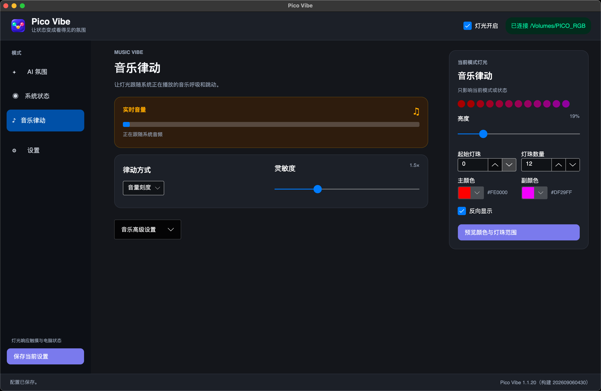
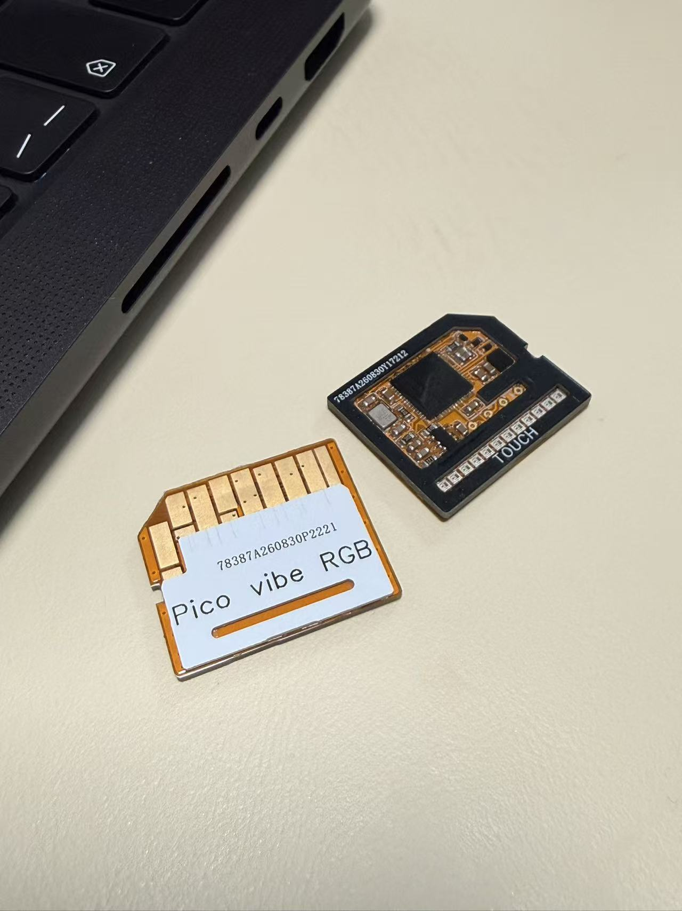
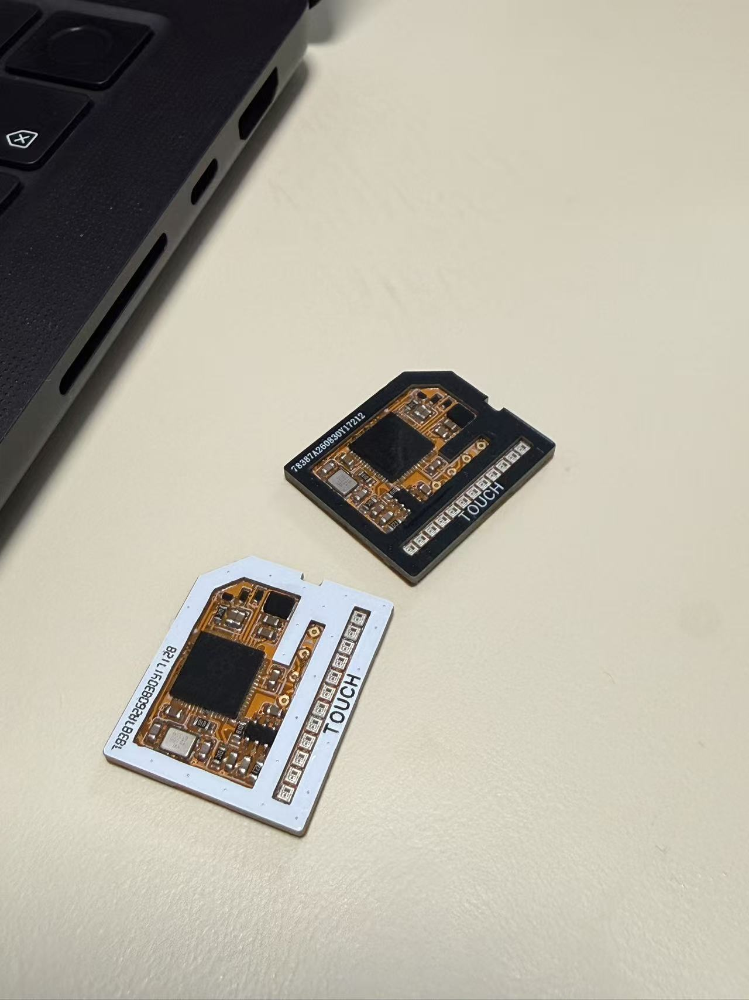

# Pico Vibe

让状态变成看得见的氛围。

Pico Vibe 是一套 **SD 卡槽短卡 RGB 灯效模块 + 桌面控制软件**：插入 MacBook / 笔记本的全尺寸 SD 卡槽即可供电通信，不占 USB。配套应用把 Cursor / Codex / Claude Code 的 AI 状态、系统负载和正在播放的音乐，变成机身边一排安静而明确的灯光；板载触摸可完成授权确认。

  

## 它是什么

| | |
|---|---|
| **硬件** | 全尺寸 SD 卡宽度的短卡模块（RP2350），板载 / 外接 12×WS2812，触摸输入 |
| **软件** | macOS / Windows 常驻控制面板，独占写入卷标 `PICO_RGB` 小磁盘 |
| **场景** | AI 编程氛围灯、系统状态灯条、音乐律动、触控审批 |

  

## 三种灯光模式

### AI 氛围

Cursor、Codex、Claude Code 的空闲 / 思考 / 执行 / 等待授权 / 完成 / 错误，各自可配颜色、效果与灯珠范围。真正需要确认时黄闪，单击触摸可批准。

### 系统状态

一眼读懂负载：CPU / 内存 / 电量 / 温度等，映射到亮度、条形或状态染色。

### 音乐律动

跟随系统正在播放的音频呼吸与跳动（macOS 用 ScreenCaptureKit 只算响度，不录音、不存画面）。

## 硬件一览

短卡形态，专为笔记本内置全尺寸 SD 卡槽设计；卡尾露出 RGB 与 `TOUCH` 触控区。

  
  &nbsp;
  

| 项 | 说明 |
|---|---|
| 主控 | RP2350（Pico 2 同系） |
| 接口 | 笔记本内置全尺寸 SD 卡槽（SDIO），不占 USB |
| 外形 | 标准全尺寸 SD 卡宽度；当前卡长约 18.8 mm |
| 发光 | 距插入端约 16.7 mm 起，末端约 2.1 mm 露灯（视卡槽深度而定） |
| 灯效 | 12×WS2812；也可改盘内文本 / 序列 / 帧文件 |
| 触摸 | 板载触摸，事件输出到 `TOUCH.TXT` |
| 磁盘 | 插入后出现小容量卷 `PICO_RGB`（RAM 盘，勿当存储卡） |
| 升级 | 拷贝签名 OTA 包到磁盘即可；正式固件带试运行回滚保护 |

> 不同机型的卡槽深度与弹出结构不同，露灯长度、能否徒手取出请以实测为准。本产品不是存储卡。

## 下载安装包

安装包只作为 **[GitHub Releases](https://github.com/huangguimin/pico_vibe/releases)** 附件发布，**不会**放进本仓库 Git 历史。

**[→ 打开最新 Release 下载](https://github.com/huangguimin/pico_vibe/releases/latest)**

| 平台 | 附件 | 说明 |
|------|------|------|
| macOS Apple Silicon | `PicoVibe-*-osx-arm64.dmg` | M 系列推荐 |
| macOS Intel | `PicoVibe-*-osx-x64.dmg` | Intel Mac |
| Windows | 客户 ZIP（见开发仓库发行说明） | 解压后运行 `INSTALL_PICO_VIBE.cmd` |

当前公开包：`PicoVibe-1.1.20`（最低 macOS 14.2）。克隆本仓库只会得到文档与配图，不含 `.dmg` / `.exe`。

## macOS 安装

1. 从 [Releases](https://github.com/huangguimin/pico_vibe/releases/latest) 下载对应架构的 DMG  
2. 将 `Pico Vibe.app` 拖入「应用程序」，或运行盘内「安装 Pico Vibe.command」  
3. 插入设备，确认出现 `/Volumes/PICO_RGB`，应用显示「已连接」  
4. 在应用 **设置 → AI 集成** 一键安装 Cursor / Codex / Claude Code Hook  
5. Codex 用户还需在 Codex 打开 `/hooks`，信任 `PicoVibeHook`  
6. 音乐律动首次需要「屏幕与系统音频录制」权限（只算响度，不取画面）

卸载可用 DMG 中的卸载脚本；用户配置默认保留在  
`~/Library/Application Support/PicoVibe/config.json`。

## 使用注意

- 请用正式安装包接入；不要手写 Hook，也不要用多个进程同时写 `PICO_RGB`  
- 只有真实权限请求才会进入黄色触控审批；普通 running / tools 不会武装授权  
- 设备掉线或触控超时：Codex / Claude Code 回落原生确认 UI；Cursor 在命中 gate 时 fail-safe 拒绝  
- 升级或重装 Hook 后，请再打开一次 `/hooks` 并信任变更项  
- 可选「灯光开启时阻止电脑闲置休眠」：睡眠会断电读卡器，唤醒后往往需重插设备  

## 诊断

- 卷标应为 `PICO_RGB`（兼容旧名 `PICO_RAM`）  
- 根目录应有 `VIBE0.BIN`、`VIBE1.BIN`，均为 512 字节邮箱  
- macOS 日志：`~/Library/Application Support/PicoVibe/pico-vibe.log`  

## 仓库说明

| 内容 | 位置 |
|------|------|
| 产品说明、配图、本 README | 本仓库 [`pico_vibe`](https://github.com/huangguimin/pico_vibe) |
| 安装包 | [Releases](https://github.com/huangguimin/pico_vibe/releases) |
| 固件、桌面端源码、量产与协议 | 开发仓库 `pico_sdio`（私有） |

本地若留下 `.dmg` / `.zip` 安装包，已被 `.gitignore` 忽略，请勿提交进 Git。
